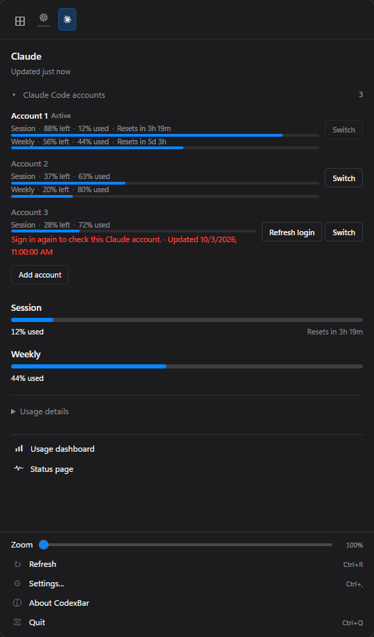
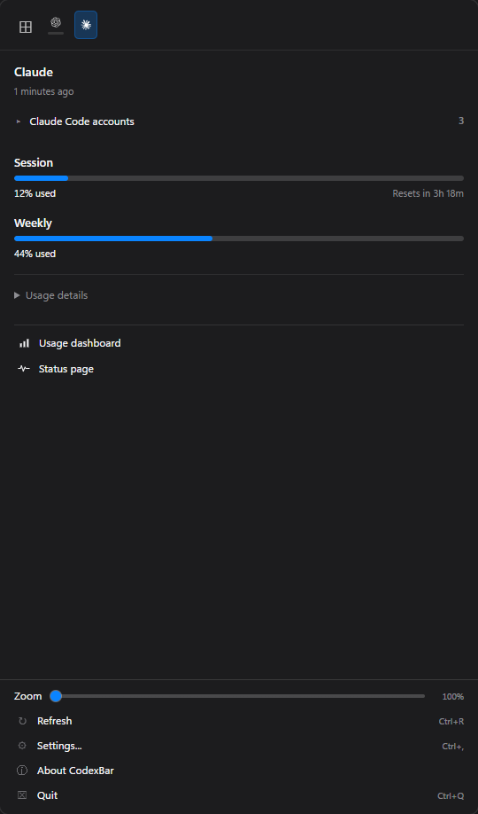

# Saved account usage and login repair: Windows proof

Captured with Cua Driver after a fresh `pnpm --dir apps/desktop-tauri run tauri:build:debug` on upstream main `f0b45ed4` plus this change. Every visible Claude account and provider quota in the attached images is synthetic; credentials, real account labels, and private logs are excluded.



The first two accounts have no Refresh login. The expired third account has Refresh login beside Switch. Add account follows the rows. The section is expanded initially and can collapse:



Native Settings UIA also reported exactly one Refresh login for the failed fixture account, below the screenshot viewport. After clearing that account's fixture error and reloading the component, Settings reported three Claude accounts and zero Refresh login controls. Healthy Codex accounts likewise had zero login controls. No sign-in, account switching, account removal, or browser authentication was invoked during native proof.

The floating bar measured **62 x 24 physical pixels at 100% scale** for both ready and expired fixtures:

 

## Reproduce the fixtures

Build the desktop first, close any older instance, and set these process-local environment variables before launching the new binary:

```powershell
$env:CODEXBAR_PROOF_MODE = 'popOut'
$env:CODEXBAR_SEED_USAGE_JSON = (Resolve-Path 'docs/proof/saved-account-login-repair/providers-ready.json').Path
$env:CODEXBAR_SEED_CLAUDE_ACCOUNTS_JSON = (Resolve-Path 'docs/proof/saved-account-login-repair/claude-accounts.json').Path
```

Enable Codex and Claude for the provider captures. For the float-bar comparison, enable the floating bar with only Codex selected, 100% scale, horizontal orientation, and inline reset and cost disabled. The capture used Show usage as used. Relaunch with `providers-expired.json` for the expired fixture. Clear the three environment variables afterward; the proof-only account getter ignores its seed outside proof mode. The capture session restored its original settings byte for byte and restarted the personal desktop build.

## Validation

`scripts/local-check.ps1 -Slice ci` passed: workspace formatting and all-target Clippy with warnings denied; 3,676 backend tests (one ignored), one CLI integration test, 619 desktop tests, 645 frontend tests across 98 files, locale parity (983 keys), frontend lint and anti-slop checks, the production build, and helper/interaction-guard tests. The fresh Windows desktop build also passed.

## Structure review

Self-review used the repository template's thermo-nuclear code-quality rubric and reviewed credential identity, persistence, cache ownership, generation guards, bridge consumers, and UI recovery. Provider logic stays in Claude's existing account/OAuth modules. Codex reuses upstream's typed authentication/session states and preserves credential alerts; permission errors do not become sign-in requests. Shared disclosure/footer behavior has one React component. Codex command tests were moved into `commands/codex_accounts/tests.rs`, keeping the command module below 1,000 lines. No blocking findings remained after these changes and the passing checks.

## Existing upstream work

- Merged #451/#452: native saved Claude accounts and tray switching.
- Merged #482: optional claude-swap usage and switching; this change supplies usage for native saved logins without requiring that adapter.
- Merged #537 and integrated #660: transient OAuth handling and typed credential-expiry alerts; their behavior is preserved.
- Draft #749: Grok saved-token renewal/login repair and some Codex/account-layout changes. Grok changes are excluded here to avoid a competing implementation. Codex window/layout edits still overlap and may need reconciliation depending on merge order.
